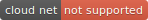

# Global statements about non-badged content

The first step toward providing logic for your publication is having a global statement about non-badged content.

> Unless otherwise indicated with a product badge such as , all content applies equally to CloudSquared Cloud Compute, Cloud Net, and Cloud Connect. 

This global statement sets the baseline logically. The only badges that the customer should expect to see would be ones that are exclusionary, identifying topics or sections that are *not* applicable to a particular product. The simpler your logic for inserting badges, the more consistently content developers can apply them and customers can understand them. In this scenario, you do not need to insert any inclusive badges, only exclusive ones. This is not unlike DITA filtering attributes that are designed, generally, to exclude content from processed output. 
  
 This topic does not apply to Cloud Compute.

 This section does not apply to Cloud Net.

 This topic does not apply to Cloud Connect.

In our use case, you would then require only six badges -- 3 products x 2 scopes (topic or section).
