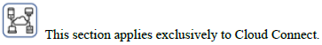
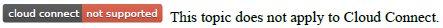
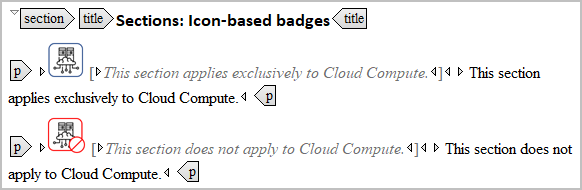
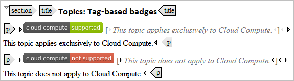

# DITA library references

DITA flagging is preferable, but not possible in all circumstances:

* Your legacy CCMS does not support flagging.
* The transforms that you use are buggy or do not support flagging.
* You do not have control over your DITAVAL files or publishing pipeline.
* Some of your sources are in non-XML formats such as Markdown or HTML5.     

The brute-force method of building libraries of content badges and then referencing them from your DITA topics is an option.
 
Start by building a library of reusable DITA badges, call it `library_content-badges.dita`. 

Here is some markup for a positive badge . . .

```xml
<p id="p_badge_icon_cloud-connect_section_yes">
    <image href="images/badge_cloud-connect_small_yes.png">  
      <alt>This section applies exclusively to Cloud Connect.</alt>
    </image>
    <ph> This section applies exclusively to Cloud Connect.</ph>
</p>
```
. . . and generates



The following markup defines a negative badge . . . 

```xml
<p id="p_badge_tag_cloud-compute_topic_no">
  <image href="images/tag_cloud-compute_not-supported.svg">
    <alt>This topic does not apply to Cloud Compute.</alt>
  </image>
  <ph> This topic does not apply to Cloud Compute.</ph>
</p>
```
. . . and generates 



Time that you spend organizing these badge definitions in a DITA library topic has a big payoff for content developers on your team. If writers can easily find the appropriate badge, they'll thank you -- eventually.  



