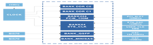

# FPGA-Elf时钟分配 {#AB135B85-D55341F-21A8712740A0600-395527 .concept}

FPGA-Elf时钟资源分为固定频率与可调频率两个部分，结构如下图所示：

-   **[固定频率部分](../concepts/EpicElfug_固定频率部分.md)**  

-   **[可调频率部分](../concepts/EpicElfug_可调频率部分.md)**  
可调频率部分由时钟管理芯片提供\(由MCU通过I2C总线编程\)。

**Parent topic:**[时钟分配](../concepts/EpicElfug_时钟分配.md)

