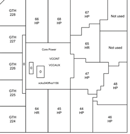

# FPGA-Elf电源信息 {#A15A5844-55161F1-5A82710A8365387-395227 .concept}

FPGA-Elf器件一共有10个bank，bank结构和供电信息如下所示：

|**FPGA Bank**|**Power NET Name**|**电压（V）**|
|Bank 0|VCCO\_B0/65|3.3|
|HP Bank 44|VCCO\_B44/45/46/66/67/68|1.8|
|HP Bank 45|VCCO\_B44/45/46/66/67/68|1.8|
|HP Bank 46|VCCO\_B44/45/46/66/67/68|1.8|
|HP Bank 47|VCCO\_B47/48/64/65|1.2|
|HP Bank 48|VCCO\_B47/48/64/65|1.2|
|HP Bank 64|VCCO\_B47/48/64/65|1.2|
|HP Bank 65|VCCO\_B0/65|3.3|
|HP Bank 66|VCCO\_B44/45/46/66/67/68|1.8|
|HP Bank 67|VCCO\_B44/45/46/66/67/68|1.8|

**Parent topic:**[电源分配](../concepts/EpicElfug_电源分配.md)

