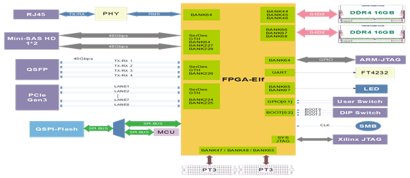

# 功能结构 {#A7453A5B-3854536-1254874571CA92D-76E036 .concept}

-   **[FPGA-Elf功能结构](../concepts/EpicElfug_fpga_elf功能结构.md)**  
 多功能子卡的2个主要器件为Xilinx intex FPGA（以下使用FPGA-Elf指代多功能子卡上的FPGA，以便与验证平台的FPGA作以区分）和STM32 MCU（以下简称MCU）。其中FPGA-Elf为功能核心，负责扩展外设。用户可对FPGA-Elf进行烧录、复位和控制。
-   **[STM32 MCU功能结构](../concepts/EpicElfug_stm32_mcu功能结构.md)**  
MCU作为板载控制器，通过以太网口与用户主机相连。用户可对MCU进行编程，以管理板载的电源、时钟和风扇。另外MCU通过Reset SPI信号与FPGA-Elf相连。MCU资源清单如下：

